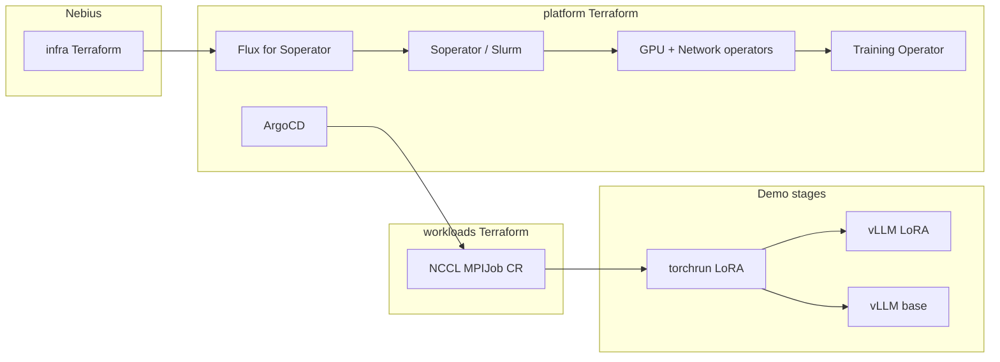

# Nebius Demo Day — Soperator on 2×H100 without InfiniBand

Reference environment: deploy [Soperator](https://github.com/nebius/soperator) from the official [solutions library](https://github.com/nebius/nebius-solutions-library), install Nebius marketplace NVIDIA operators, run the [NCCL test](https://docs.nebius.com/kubernetes/gpu/nccl-test) over Ethernet (not InfiniBand), then fine-tune and serve on the same MK8s cluster.

**Pinned recipe:** [`soperator-v4.1.8-1`](https://github.com/nebius/nebius-solutions-library/releases/tag/soperator-v4.1.8-1) (not `main`).

Glossary: [docs/00-glossary.md](docs/00-glossary.md).

## Scope

[`k8s-training`](https://github.com/nebius/nebius-solutions-library/tree/main/k8s-training) targets 8×H100 plus InfiniBand. This lab is **2×1×H100, no InfiniBand**, and uses **Soperator**.

| Layer | Upstream | Overlay |
| --- | --- | --- |
| Cluster + Slurm | `soperator/` Terraform via `git::` | tfvars: 1gpu preset, sentinel `gpu_cluster.id`, CPU table |
| GPU + Network operators | Marketplace OCI charts | Helm in `terraform/platform`, `driver.enabled=false` |
| NCCL test | Official MPIJob + `nccl-tests` image + Training Operator v1.9.3 | Workloads stack, Ethernet |
| GitOps | Flux (Soperator internals only) | ArgoCD in platform; CRs in workloads Terraform |
| Training / vLLM | Slurm on that cluster | `workloads/*.sbatch` |

| Stage | What runs |
| --- | --- |
| 1 | Soperator + 2-node LoRA SFT of Qwen2.5-7B-Instruct |
| 2 | vLLM Slurm job serving the LoRA adapter |
| 3 | Second vLLM job with the original model + `compare.py` |
| 4 | Both H100s busy in Nebius dashboards (≥80%) |



## Runbook

### Stage 1 — cluster and distributed training

1. `./scripts/00-install_prereqs.sh` (Terraform, Nebius CLI, kubectl, Helm, jq, yq, coreutils; skips tools already on PATH).
2. `./scripts/01-seed_envrc.sh` — tenant/project from the Nebius CLI profile (lab defaults if unset) into `.envrc`, SSH public key from `~/.ssh/id_rsa.pub` into `terraform.tfvars`.
3. `./scripts/02-apply_infra.sh` — `source .envrc && terraform init && terraform apply` in `terraform/infra`. Writes `terraform/kubeconfig`.
4. `./scripts/03-apply_platform.sh` — platform (Flux, Soperator, GPU Operator, Training Operator, ArgoCD) then workloads (`login.sh` + ConfigMap).
5. Optional Ethernet NCCL MPIJob: `./scripts/04-scale_slurm_gpu_workers.sh 0`, then `terraform apply -var=enable_nccl_mpijob=true` in `terraform/workloads`, then scale workers back (see [docs/05-gitops-operators-nccl.md](docs/05-gitops-operators-nccl.md)).
6. `terraform/workloads/login.sh -k <ssh-private-key>` then `sinfo`.
7. `./scripts/05-sync_workloads.sh <ssh-private-key> <login-ip>`.
8. On login: `bash /mnt/data/nebius-demo/workloads/setup_env.sh`.
9. `sbatch /mnt/data/nebius-demo/workloads/train.sbatch`.
10. Confirm `world_size=2`, adapters at `/mnt/data/nebius-demo/checkpoints/helios-lora`, both GPUs busy.

Detail: [docs/01-task-1-soperator-training.md](docs/01-task-1-soperator-training.md).  
Operators + ArgoCD + NCCL: [docs/05-gitops-operators-nccl.md](docs/05-gitops-operators-nccl.md).  
InfiniBand Terraform notes: [docs/terraform-infiniband-changes.md](docs/terraform-infiniband-changes.md).

### Stage 2 — serve the trained model

1. `sbatch workloads/serve_ft.sbatch`
2. Tunnel with `./scripts/06-tunnel_inference.sh`.
3. `curl` `/v1/chat/completions` with model `helios`.

[docs/02-task-2-inference.md](docs/02-task-2-inference.md)

### Stage 3 — serve the original model and compare

1. `sbatch workloads/serve_base.sbatch` (second GPU).
2. `python workloads/compare.py`
3. Artifact: `outputs/comparison.md`.

[docs/03-task-3-compare-models.md](docs/03-task-3-compare-models.md)

### Stage 4 — GPU utilization

1. Capture Nebius GPU dashboards during training.
2. If needed, `python workloads/loadgen.py --seconds 180` against both servers.

[docs/04-task-4-gpu-utilization.md](docs/04-task-4-gpu-utilization.md)

## Constraints

- Training + inference GPU limit = **2×H100**, **1×H100 per node**
- Single MK8s cluster
- Single-GPU H100 preset **does not support InfiniBand**
- `public_o11y_enabled = false`
- Do not share one filesystem between two jails
- CPU nodesets sized to **6 nodes / 52 vCPU** (see tfvars)
- Retain the environment for the duration of the demo

## Repository layout

```
docs/            # glossary, runbooks, architecture, walkthrough
gitops/          # CR YAML consumed by Terraform (and optional kustomize)
terraform/       # infra (cloud) + platform (operators) + workloads (CRs + login.sh)
scripts/         # 01 bootstrap → 06 vLLM tunnel (see scripts/README.md)
workloads/       # train / serve / compare / loadgen
presentation/    # PowerPoint source + generated deck
```

Architecture: [docs/architecture.md](docs/architecture.md).  
Walkthrough: [docs/demo-script.md](docs/demo-script.md).  
Slides: [presentation/Nebius-Demo-Day.pptx](presentation/Nebius-Demo-Day.pptx).

## Overlay notes

Terraform overlay: `terraform/infra/terraform.tfvars`.

- Soperator `4.1.8` on 2×`1gpu-16vcpu-200gb` without attaching InfiniBand; 2-node LoRA SFT; optional vLLM A/B.
- Stock recipe assumes an IB GPU cluster; empty `infiniband_fabric` fails validation; NCCL is forced onto Ethernet; vLLM is a Slurm job because workers already own the GPUs.

## License

MIT. Soperator module bodies stay in [nebius/nebius-solutions-library](https://github.com/nebius/nebius-solutions-library) and are fetched at tag `soperator-v4.1.8-1`. This repository keeps an infra cloud stack, a platform operator stack (including Soperator/Flux), and a workloads CR stack. Kubeconfig is local (`terraform/kubeconfig`), not Vault.
