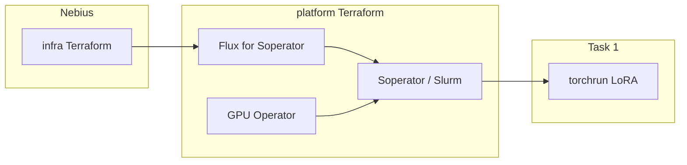

# Nebius Demo Day — Soperator on 2×H100 without InfiniBand

Deploy [Soperator](https://github.com/nebius/soperator) from the official [solutions library](https://github.com/nebius/nebius-solutions-library), install the Nebius marketplace NVIDIA GPU Operator, then fine-tune Qwen2.5-7B-Instruct with LoRA across two Ethernet H100s.

**Pinned recipe:** [`soperator-v4.1.8-1`](https://github.com/nebius/nebius-solutions-library/releases/tag/soperator-v4.1.8-1) (not `main`).

Assignment brief: [docs/overview/assignment.md](docs/overview/assignment.md).  
Status (done vs missing): [docs/overview/status.md](docs/overview/status.md).  
Docs index: [docs/README.md](docs/README.md).  
Task 1 report (job 73 logs + GPU screenshots): [docs/task-1/report.md](docs/task-1/report.md).  
Glossary: [docs/overview/glossary.md](docs/overview/glossary.md).  
Task 1 gotchas: [docs/task-1/gotchas.md](docs/task-1/gotchas.md).

## Scope

[`k8s-training`](https://github.com/nebius/nebius-solutions-library/tree/main/k8s-training) targets 8×H100 plus InfiniBand. This lab is **2×1×H100, no InfiniBand**, and uses **Soperator**.

| Layer | Upstream | Overlay |
| --- | --- | --- |
| Cluster + Slurm | `soperator/` Terraform via `git::` | tfvars: 1gpu preset, sentinel `gpu_cluster.id`, CPU table |
| GPU Operator | Marketplace OCI chart | Helm in `terraform/platform`, `driver.enabled=false` |
| Training | Slurm on that cluster | `task-1/train.sbatch` |



## Runbook

1. `./task-1/00-install_prereqs.sh` (Terraform, Nebius CLI, kubectl, Helm, jq, yq, coreutils; skips tools already on PATH).
2. `./task-1/01-seed_tfvars.sh` — tenant/project/region/subnet and SSH public key path into `terraform.tfvars`.
3. `./task-1/02-apply_infra.sh` — `terraform init && terraform apply` in `terraform/infra`. Writes `terraform/kubeconfig`.
4. `./task-1/03-apply_platform.sh` — platform (Flux, Soperator, GPU Operator).
5. `./task-1/04-sync.sh`
6. `./task-1/05-login.sh` then `sinfo`.
7. On login: `bash /mnt/data/nebius-demo/task-1/setup_env.sh`.
8. `sbatch /mnt/data/nebius-demo/task-1/train.sbatch`.
9. Confirm `world_size=2`, adapters at `/mnt/data/nebius-demo/checkpoints/dolly-lora`, both GPUs busy.
10. Extra mile (task 2): `./task-2/01-gpu_mode.sh serve` then port-forward `svc/vllm`. Flip back with `./task-2/01-gpu_mode.sh train`.

Detail: [docs/task-1/training.md](docs/task-1/training.md).  
InfiniBand Terraform notes: [docs/task-1/terraform-infiniband.md](docs/task-1/terraform-infiniband.md).

## Constraints

- GPU limit = **2×H100**, **1×H100 per node**
- Single MK8s cluster
- Single-GPU H100 preset **does not support InfiniBand**
- `public_o11y_enabled = false`
- Do not share one filesystem between two jails
- CPU nodesets sized to **8 nodes / 64 vCPU** after Accounting + NFS are applied (see [docs/overview/status.md](docs/overview/status.md))
- Retain the environment for the duration of the demo

## Repository layout

```
docs/            # overview + task-1 … task-4
gitops/          # notes; operators are Terraform in terraform/platform
terraform/       # infra (cloud) + platform (operators)
task-1/          # 00–07 runbook, train.sbatch / train.py / setup_env.sh
task-2/          # 01-gpu_mode.sh, vLLM Deployment
presentation/    # PowerPoint source + generated deck
```

Architecture: [docs/task-1/architecture.md](docs/task-1/architecture.md).  
Walkthrough: [docs/task-1/demo-script.md](docs/task-1/demo-script.md).  
Slides: [presentation/Nebius-Demo-Day.pptx](presentation/Nebius-Demo-Day.pptx).

## Overlay notes

Terraform overlay: `terraform/infra/terraform.tfvars`.

- Soperator `4.1.8` on 2×`1gpu-16vcpu-200gb` without attaching InfiniBand; 2-node LoRA SFT.
- Stock recipe assumes an IB GPU cluster; empty `infiniband_fabric` fails validation; NCCL is forced onto Ethernet.

## License

MIT. Soperator module bodies stay in [nebius/nebius-solutions-library](https://github.com/nebius/nebius-solutions-library) and are fetched at tag `soperator-v4.1.8-1`. This repository keeps an infra cloud stack and a platform operator stack (including Soperator/Flux). Kubeconfig is local (`terraform/kubeconfig`), not Vault.
