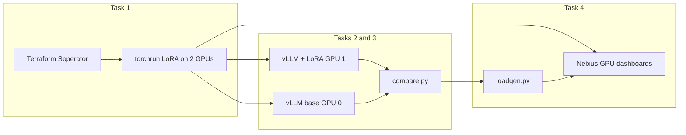

# Nebius Demo Day — Soperator on 2×H100 without InfiniBand

Interview lab for Nebius Demo Day: deploy [Soperator](https://github.com/nebius/soperator) with Terraform, fine-tune a small LLM across two Ethernet-only H100s, serve base and fine-tuned models with vLLM on the same MK8s cluster, and show GPU utilization.

**Pinned recipe:** [`soperator-v4.1.8-1`](https://github.com/nebius/nebius-solutions-library/releases/tag/soperator-v4.1.8-1) (not `main`).

If you already know **vLLM** and the **NVIDIA GPU Operator**, start with [docs/00-glossary.md](docs/00-glossary.md).

## Simplest path that still hits all four tasks

| Task | What we do | Pass? |
| --- | --- | --- |
| 1 | Soperator + 2-node LoRA SFT of Qwen2.5-7B-Instruct | Required |
| 2 | vLLM Slurm job serving the LoRA adapter | Bonus |
| 3 | Second vLLM job with the original model + side-by-side prompts | Bonus |
| 4 | Both H100s busy in Nebius dashboards (≥80%) | Bonus |

Why this shape:

- **One cluster, Slurm for everything.** Soperator worker pods already own the GPUs. Training and vLLM are `sbatch` jobs, not extra Deployments.
- **LoRA, not full fine-tune.** Real distributed training, small checkpoint, obvious before/after on a made-up Helios Robotics FAQ.
- **Ethernet NCCL.** `1gpu-16vcpu-200gb` cannot join a GPU cluster / InfiniBand fabric. Terraform sets `gpu_cluster = null`. Training sets `NCCL_IB_DISABLE=1`.



## Step list (do these in order)

### Task 1 — cluster + distributed training

1. Install Terraform, Nebius CLI, kubectl, jq, **yq**, coreutils.
2. Wait for sandbox console + Slack. Keep discussion in Slack.
3. `./scripts/bootstrap_soperator.sh` (clones `soperator-v4.1.8-1`).
4. Set `NEBIUS_TENANT_ID` / `NEBIUS_PROJECT_ID` in the vendored `.envrc`.
5. Put your SSH public key in `terraform/installations/demo-day/terraform.tfvars` and re-run bootstrap.
6. `source .envrc && terraform init && terraform apply` in the installation dir (~40 min).
7. `./login.sh -k ~/.ssh/<key>` then `sinfo`.
8. From the laptop: `./scripts/sync_workloads.sh ~/.ssh/<key> <login-ip>`.
9. On login: `bash /mnt/data/nebius-demo/workloads/setup_env.sh`.
10. `sbatch /mnt/data/nebius-demo/workloads/train.sbatch`.
11. Confirm `world_size=2`, adapters at `/mnt/data/nebius-demo/checkpoints/helios-lora`, both GPUs busy.

Full detail: [docs/01-task-1-soperator-training.md](docs/01-task-1-soperator-training.md).  
InfiniBand Terraform notes: [docs/terraform-infiniband-changes.md](docs/terraform-infiniband-changes.md).

### Task 2 — serve the trained model

1. `sbatch workloads/serve_ft.sbatch`
2. Tunnel with `./scripts/tunnel_inference.sh`.
3. `curl` `/v1/chat/completions` with model `helios`.

[docs/02-task-2-inference.md](docs/02-task-2-inference.md)

### Task 3 — serve the original model and compare

1. `sbatch workloads/serve_base.sbatch` (second GPU).
2. `python workloads/compare.py`
3. Keep `outputs/comparison.md` for the email + call.

[docs/03-task-3-compare-models.md](docs/03-task-3-compare-models.md)

### Task 4 — GPU utilization

1. Screenshot Nebius GPU dashboards during training.
2. If needed, `python workloads/loadgen.py --seconds 180` against both servers.

[docs/04-task-4-gpu-utilization.md](docs/04-task-4-gpu-utilization.md)

## Constraints we designed around

- Training + inference GPU limit = **2×H100**, **1×H100 per node**
- Single MK8s cluster
- Single-GPU H100 preset **does not support InfiniBand**
- `public_o11y_enabled = false`
- Do not share one filesystem between two jails
- CPU nodesets sized to **8 nodes / 64 vCPU** (see tfvars)
- Do not destroy the lab until after the demo interview

## Repo layout

```
docs/            # glossary, per-task runbooks, architecture, demo script
terraform/       # tfvars overlay for the official recipe
scripts/         # bootstrap, rsync, SSH tunnel
workloads/       # train / serve / compare / loadgen
presentation/    # PowerPoint source + generated deck
```

Architecture diagrams: [docs/architecture.md](docs/architecture.md).  
Interview flow: [docs/demo-script.md](docs/demo-script.md).  
Slides: [presentation/Nebius-Demo-Day.pptx](presentation/Nebius-Demo-Day.pptx).

## Submission email (when you are done)

Reply on the original thread. Do not decommission. Attach this repo's Terraform overlay (`terraform/installations/demo-day/terraform.tfvars`) and say:

- What worked: Soperator `4.1.8` on 2×`1gpu-16vcpu-200gb` with `gpu_cluster = null`; 2-node LoRA SFT; optional vLLM A/B.
- What was hard: stock recipe assumes an IB GPU cluster; empty `infiniband_fabric` fails validation; NCCL must be forced onto Ethernet; vLLM must be a Slurm job because workers already own the GPUs.

## License

MIT. Soperator Terraform modules remain under Nebius's license in the cloned `vendor/` tree (not committed).
