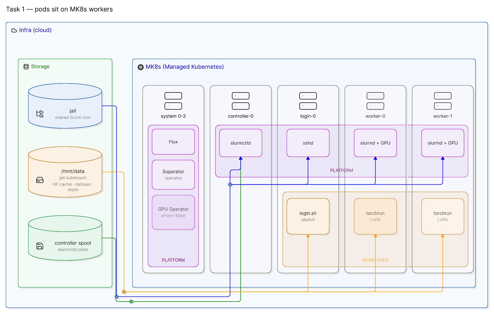
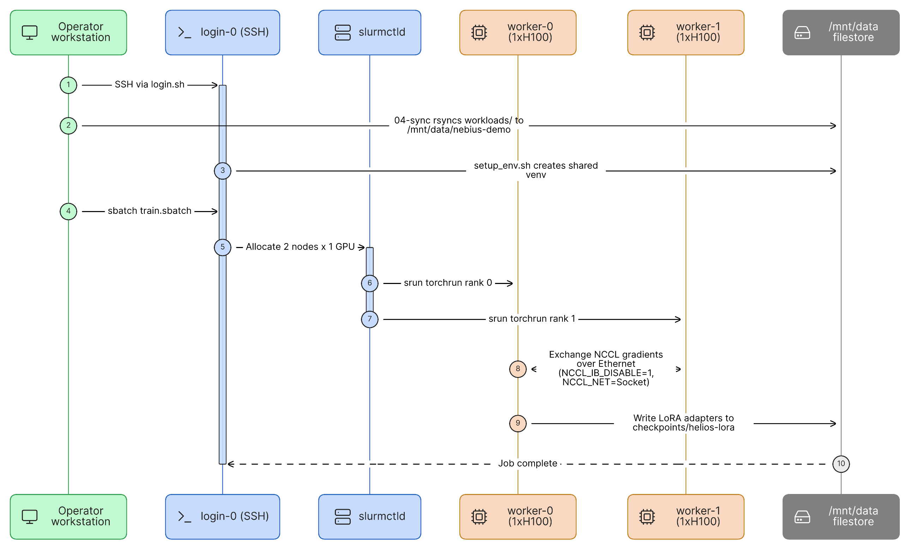

# Task 1 architecture — two Terraform stacks

Task 1 is **2-node LoRA SFT** of `Qwen2.5-7B-Instruct` on Soperator. Training is a Slurm job (`sbatch`), not a Kubernetes GPU Deployment. InfiniBand is not used (`1gpu-16vcpu-200gb` cannot join a GPU cluster).

Gotchas from standing this up: [01-task-1-gotchas.md](01-task-1-gotchas.md).

Two applies, in order. Each stack owns a different layer.

**How to read it.** Infra is filestore + MK8s. The four system workers are one column (`system 0-3`) with Flux, Soperator, and GPU Operator stacked. `kube-system` is omitted — that is MK8s control-plane, not something we install. The purple **PLATFORM** overlay spans `controller-0` … `worker-1`. The orange **WORKLOADS** overlay spans `login-0` + `worker-0` + `worker-1`. Jail CSI mounts on the Slurm pods (`slurmctld`, `sshd`, `slurmd`); `/mnt/data` on `05-login.sh` / `torchrun`; controller spool on `slurmctld` only. `controller-0` is Slurm’s scheduler, not a Kubernetes master.

| Node | Kubernetes | Slurm | Platform on that node | Workloads on that node |
| --- | --- | --- | --- | --- |
| *(not pictured)* control plane | **Master** | — | — | — |
| system 0-3 | Worker | — | Flux, Soperator operator, GPU Operator | — |
| controller-0 | Worker | **Controller** (`slurmctld`) | `slurmctld` | — |
| login-0 | Worker | **Login** (submit) | `sshd` | `05-login.sh` / `sbatch` |
| worker-0 / worker-1 | Worker | **Compute** (`slurmd`) | `slurmd` + `nvidia.com/gpu` | `torchrun` LoRA |

Source / Eraser IDs: [diagrams/](diagrams/).

| Stack | Script | Lives in | Owns |
| --- | --- | --- | --- |
| **Infra** | `02-apply_infra.sh` | `terraform/infra` | Nebius cloud only: MK8s, node groups, filestore. No Helm. |
| **Platform** | `03-apply_platform.sh` | `terraform/platform` | Operators on that cluster: Flux, Soperator/Slurm, GPU Operator. |
| **Workloads** | `04-sync` then `05-login` | `workloads/` | Files on the jail so `sbatch` can run. |

Platform authenticates with the **local kubeconfig** infra writes (`terraform/kubeconfig`, gitignored). It reads infra outputs via **local remote state**.

---

## Infra — cloud resources

`terraform/infra` talks to the Nebius API only. After this apply you have an empty MK8s cluster and disks. **Soperator is not installed yet.** Filestore mounts onto the node groups later via CSI. Slurm pods are not created in this apply. The blue **INFRA** band in the diagram above is this stack.

Node groups are created now; Slurm pods land on them in the platform apply.

| Resource | Spec | Role in Task 1 |
| --- | --- | --- |
| System nodes | 4 × `8vcpu-32gb` | Flux, Soperator operator, GPU Operator |
| Controller node | 1 × `4vcpu-16gb` | `slurmctld` |
| Login node | 1 × `16vcpu-64gb`, public IP | SSH + `sbatch` / `sinfo` |
| GPU workers | 2 × `gpu-h100-sxm` / `1gpu-16vcpu-200gb` | `worker-0`, `worker-1` — one H100 each |
| Jail | NETWORK_SSD | Shared OS / Python env for every Slurm pod |
| `/mnt/data` | jail submount | HF cache, dataset, checkpoints, logs |
| Controller spool | NETWORK_SSD | Slurm controller state |

Overlays that exist because this is **not** the stock 8-GPU InfiniBand recipe:

- `gpu_cluster.id = "ethernet-not-attached"` — satisfies the stock Terraform check without creating a GPU cluster (this preset cannot join one).
- 1-GPU **GRES** (`gres.conf`: Slurm’s map of which GPU device files and CPU cores exist) — `/dev/nvidia0`, `Cores=0-7`. Stock map is 8 GPUs / `Cores=0-31` and crashes `slurmctld` on 16-CPU nodes. Thread IDs `Cores=0-15` let the controller start but drop GPUs from scheduling.
- Preinstalled CUDA drivers on the MK8s image (`use_preinstalled_gpu_drivers = true`).
- Accounting (hardcoded off), NFS, public o11y: off.

---

## Platform — operators on the cluster

`terraform/platform` uses the kubeconfig and infra remote state. It installs the software that turns those node groups into a Slurm cluster. The purple **PLATFORM** band in the diagram is this stack (Flux, Soperator pods, GPU Operator).

| Component | Why Task 1 needs it |
| --- | --- |
| **Flux** | Soperator’s installer. The Slurm module publishes HelmReleases into `flux-system`. |
| **Soperator** | Turns a `SlurmCluster` CR into login / controller / worker pods. Workers **hold** `nvidia.com/gpu`. |
| **GPU Operator** | Exposes `nvidia.com/gpu`. Drivers are already on the node image, so `driver.enabled=false`. No Network Operator (no InfiniBand). |
| **Flux overlay** (`04-soperator-flux-overlay.tf`) | Sets `runAfterCreation: false` on activechecks that never get a status write on this Ethernet 1-GPU lab, so Terraform does not wait 240 minutes. |

GPU ownership after platform is Ready: both H100s are bound to Soperator worker pods. A Kubernetes GPU pod would stay `Pending`. Training must go through Slurm.

---

## Workloads — how Task 1 actually runs

Training is not a Terraform apply. `04-sync_workloads.sh` copies job files onto the jail; `05-login.sh` SSHes to the login LoadBalancer. Then you `sbatch`. The orange **WORKLOADS** band in the diagram is this path.

| Piece | Role in Task 1 |
| --- | --- |
| `04-sync_workloads.sh` | Copies local `workloads/` onto `/mnt/data/nebius-demo/workloads/`. |
| `05-login.sh` | SSH to the login LoadBalancer (`soperator-login-svc`). |
| `setup_env.sh` | Creates a shared venv on the jail so both ranks see the same Python. |
| `train.sbatch` / `train.py` | The actual Task 1 job. |

### Training runtime

DSL: [diagrams/task-1-training-flow.eraser](diagrams/task-1-training-flow.eraser).

What the job does:

1. Slurm allocates `worker-0` and `worker-1` (`--nodes=2`, `--gpus-per-node=1`).
2. `srun torchrun` starts one process per node (`--nproc_per_node=1`).
3. Rank 0 is the c10d rendezvous on Ethernet (`eth0`).
4. Each rank loads Qwen2.5-7B-Instruct, freezes base weights, attaches LoRA.
5. Each rank trains on a shard of `helios_faq.jsonl`.
6. Gradients average over TCP (NCCL Socket), not InfiniBand.
7. Rank 0 writes adapters to `/mnt/data/nebius-demo/checkpoints/helios-lora`.

Success looks like `world_size=2`, decreasing loss, and adapter files on the shared volume.

---

## End-to-end

Scripts for this path: `00` prereqs → `01` seed → `02` infra → `03` platform → `04-sync` → `05-login` / `sinfo` → `setup_env.sh` → `sbatch train.sbatch`.
