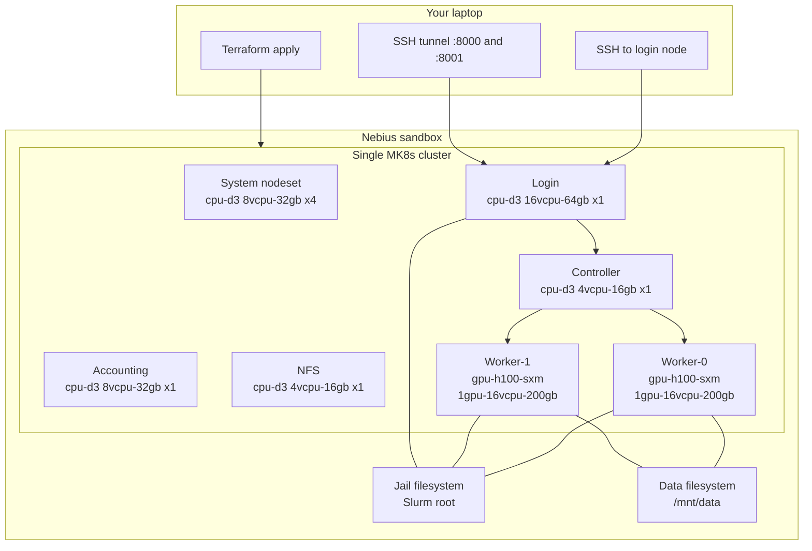
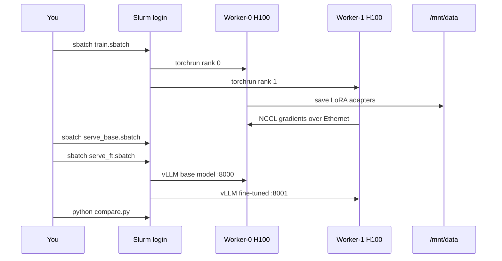

# Architecture

Soperator is Slurm-on-Kubernetes. One MK8s cluster, one Slurm control plane, two Ethernet-only H100 workers.



## What runs where



## Storage layout (one jail, one data volume)

| Mount | Purpose | Created by |
| --- | --- | --- |
| Jail root (`/`) | Shared OS + conda env + scripts | `filestore_jail` spec |
| `/mnt/data` | HF cache, dataset, checkpoints, comparison JSON | `filestore_jail_submounts` |
| Accounting FS | Slurm accounting DB | `filestore_accounting` spec |

Do not reuse an existing filesystem that is already attached as another cluster's jail.

## Networking (the whole point of the Terraform change)

| Path | Used? | Why |
| --- | --- | --- |
| InfiniBand / GPU cluster artifact | No | `1gpu-16vcpu-200gb` is not GPU-cluster compatible |
| Ethernet / TCP via NCCL Socket | Yes | Two-node DDP still works; slower than IB, fine for 2 GPUs |
| SSH to login public IP | Yes | Job submit + port-forward for vLLM |

The stock Soperator example sets:

```hcl
gpu_cluster = {
  infiniband_fabric = ""
}
```

That **fails validation** (`gpu_cluster must set either id or infiniband_fabric`). The fix is `gpu_cluster = null`, which skips `nebius_compute_v1_gpu_cluster` and leaves `template.gpu_cluster` unset on the MK8s node group.

## GPU ownership

Slurm worker pods take the GPUs. Training and vLLM are Slurm jobs, not extra Kubernetes Deployments.
