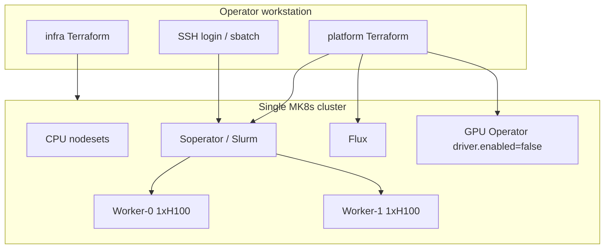
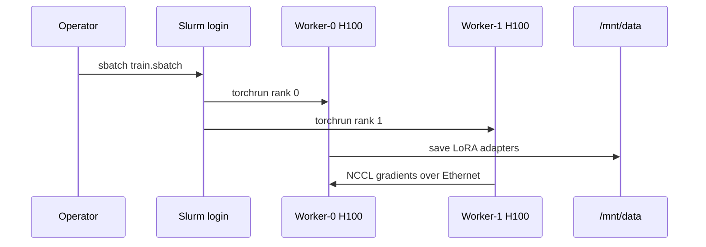

# Architecture

Task 1 stack diagrams (infra / platform / workloads): [architecture-task-1.md](architecture-task-1.md).

Soperator is Slurm-on-Kubernetes. Cloud resources (MK8s, node groups, filestore) come from the official [solutions library](https://github.com/nebius/nebius-solutions-library) recipe in `terraform/infra`. Operators (Flux, Soperator, NVIDIA GPU Operator) live in `terraform/platform`. SSH and file sync are shell scripts in `scripts/`. Platform authenticates with a local `terraform/kubeconfig` (not stored in Vault). Training is a Slurm job.



## Runtime flow



## Storage (one jail, one data volume)

| Mount | Purpose | Created by |
| --- | --- | --- |
| Jail root (`/`) | Shared OS, Python environment, scripts | `terraform/infra/02-filestore.tf` |
| `/mnt/data` | Hugging Face cache, dataset, checkpoints | same file (`/mnt/data` submount) |

A filesystem that is already a jail for another cluster must not be reused.

## Networking

| Path | Used | Reason |
| --- | --- | --- |
| InfiniBand / GPU cluster | No | `1gpu-16vcpu-200gb` is not GPU-cluster compatible |
| Ethernet / TCP (NCCL Socket) | Yes | Two-node DDP works; bandwidth is lower than IB, sufficient for two GPUs |
| SSH to login public IP | Yes | Job submit |

The stock Soperator example sets:

```hcl
gpu_cluster = {
  infiniband_fabric = ""
}
```

That fails validation (`gpu_cluster` must set `id` or `infiniband_fabric`). `gpu_cluster = null` also fails the stock fabric check, which requires a cluster on every GPU preset. This overlay sets `gpu_cluster.id = "ethernet-not-attached"` so validation passes. `1gpu-16vcpu-200gb` is not `gpu_cluster_compatible`, so the MK8s node group still has `template.gpu_cluster = null` and no `nebius_compute_v1_gpu_cluster` is created.

Stock **GRES** (`gres.conf`: Slurm’s GPU device-and-CPU map) is also 8-GPU (`Cores=0-31`). That crashes `slurmctld` on these 16-CPU nodes. Infra overrides it to `/dev/nvidia0` `Cores=0-7` (logical cores on the socket). `Cores=0-15` is invalid and GPU jobs never place. See [GRES overlay](terraform-infiniband-changes.md#gres-gresconf).

## GPU ownership

Slurm worker pods hold the GPUs. Training runs as a Slurm job.
