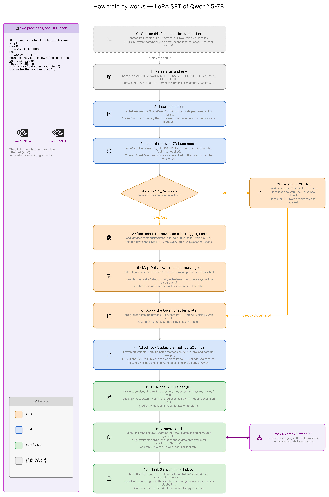

# How `train.py` works (beginner)

`workloads/train.py` is the Python that actually fine-tunes the model. It does **not** start the cluster, allocate GPUs, or talk to Kubernetes. Slurm already did that. This file is the recipe one GPU process follows.

Eraser canvas: [How train.py works](https://app.eraser.io/workspace/WhfhqNvtzQqdMDHNmSNk?diagram=FRx91CaBWFE7llagz8xQ&layout=canvas). Cluster-level sequence (sbatch → torchrun): [architecture.md](architecture.md).



## The one idea to keep

You are not training Qwen from scratch. You start from a finished chat model (`Qwen/Qwen2.5-7B-Instruct`), freeze those weights, and train a small stack of **LoRA adapters** (sticky notes on a closed textbook). The thing you save is those notes, not a second copy of Qwen.

Two copies of this script run at the same time:

| Process | Where | GPU |
| --- | --- | --- |
| rank 0 | `worker-0` | 1× H100 |
| rank 1 | `worker-1` | 1× H100 |

`train.sbatch` starts them with `srun torchrun`. Both run every step below. They only differ in which slice of data they see, and that **only rank 0 writes the checkpoint**.

## Libraries (what each one is for)

| Import | Job |
| --- | --- |
| `transformers` | Load the tokenizer and the 7B Qwen weights |
| `datasets` | Download Dolly (or a JSONL) and map rows |
| `peft` | Attach LoRA adapters; freeze the base model |
| `trl.SFTTrainer` | The training loop (supervised fine-tuning) |
| `torch` | GPU tensors; `torchrun` already set up DDP |

## Step by step

### 0. Outside this file

`sbatch train.sbatch` asks Slurm for 2 nodes × 1 GPU, activates the shared venv, sets `HF_HOME=/mnt/data/nebius-demo/hf_cache`, then `torchrun` launches `train.py` twice. Cache, data, and checkpoints all live on `/mnt/data` so both ranks see the same files.

### 1. Read knobs and prove the GPU is there

```32:35:workloads/train.py
    parser.add_argument("--hf-dataset", default=os.environ.get("HF_DATASET", "databricks/databricks-dolly-15k"))
    parser.add_argument("--hf-split", default=os.environ.get("HF_SPLIT", "train[:1500]"))
    parser.add_argument("--epochs", type=float, default=float(os.environ.get("EPOCHS", "1")))
    parser.add_argument("--grad-accum", type=int, default=int(os.environ.get("GRAD_ACCUM", "4")))
```

Flags default to environment variables from `train.sbatch`. `LOCAL_RANK` and `WORLD_SIZE` come from `torchrun`. The print of `cuda=True` / `n_gpu=1` is the sanity check: if that is false, you submitted a CPU job.

### 2. Load the tokenizer

A **tokenizer** is a dictionary: text in, integer IDs out. The model never sees words; it sees those IDs. We load Qwen’s tokenizer so training strings match how the model was originally taught to chat. If it has no pad token, we reuse the end-of-sequence token.

### 3. Load the frozen 7B model

```86:92:workloads/train.py
    model = AutoModelForCausalLM.from_pretrained(
        args.model,
        torch_dtype=torch.bfloat16,
        attn_implementation="sdpa",
        trust_remote_code=True,
    )
    model.config.use_cache = False
```

**Causal LM** means “predict the next token.” That is how chat models are trained. `bfloat16` is a compact float that H100s like. `use_cache=False` turns off the chat-time speed trick; during training we recompute activations. First run downloads Qwen into `HF_HOME`; later runs reuse the cache.

These weights stay frozen. LoRA (step 7) is what actually learns.

### 4. Load the dataset

```60:70:workloads/train.py
def load_sft_dataset(args: argparse.Namespace):
    if args.data:
        print(f"dataset=json data_files={args.data}")
        return load_dataset("json", data_files=args.data, split="train")

    cache_dir = os.environ.get("HF_HOME")
    print(f"dataset={args.hf_dataset} split={args.hf_split} hf_home={cache_dir}")
    ds = load_dataset(args.hf_dataset, split=args.hf_split)
```

Default: Hugging Face `databricks/databricks-dolly-15k`, first 1,500 rows. Cached under `HF_HOME`. If you set `TRAIN_DATA` to a JSONL that already has a `messages` column (the old Helios FAQ), that file is used instead and step 5 is skipped.

### 5. Turn Dolly into chat messages

Dolly rows look like `instruction` / `context` / `response`. Qwen expects a chat:

```
user:      instruction + optional context
assistant: response
```

```47:57:workloads/train.py
def dolly_to_messages(example: dict) -> dict:
    instruction = (example.get("instruction") or "").strip()
    context = (example.get("context") or "").strip()
    response = (example.get("response") or "").strip()
    user = f"{instruction}\n\n{context}" if context else instruction
    return {
        "messages": [
            {"role": "user", "content": user},
            {"role": "assistant", "content": response},
        ]
    }
```

Example from the preview file: user asks when Virgin Australia started, with a Wikipedia-style paragraph; assistant answers with the date.

### 6. Apply the Qwen chat template

Each model family wraps messages in special tokens (`<|im_start|>user`, and so on). `apply_chat_template` does that wrapping. After this map, the dataset is a single `text` column — the string we will train on.

### 7. Attach LoRA (the sticky notes)

```107:114:workloads/train.py
    lora = LoraConfig(
        r=args.lora_r,
        lora_alpha=args.lora_alpha,
        lora_dropout=0.05,
        bias="none",
        task_type="CAUSAL_LM",
        target_modules=["down_proj", "gate_proj", "k_proj", "o_proj", "q_proj", "up_proj", "v_proj"],
    )
```

Full fine-tuning would edit all 7 billion weights. **LoRA** leaves them alone and trains small extra matrices on the attention and MLP projections (`q/k/v/o` and `gate/up/down`). `r=16` is the size of those matrices. The checkpoint is on the order of **155MB**, not another 14GB model.

### 8. Build the trainer

**SFT** = supervised fine-tuning: show `(prompt, desired answer)` pairs until next-token prediction copies the assistant’s style.

The important knobs from `train.sbatch`:

| Knob | Default | Meaning |
| --- | --- | --- |
| `per_device_train_batch_size` | 4 | Examples per GPU per step |
| `gradient_accumulation_steps` | 4 | Wait 4 steps before applying an update (effective batch 4×4×2 ranks) |
| `num_train_epochs` | 1 | One pass over the 1,500 Dolly rows |
| `packing` | True | Glue short examples together so the GPU is not idle on padding |
| `max_length` | 2048 | Truncate long strings |
| `bf16` | True | Train in bfloat16 |
| `gradient_checkpointing` | True | Recompute activations to save GPU memory |

`SFTTrainer` gets the model, the LoRA config, the tokenizer, and the text dataset. `peft_config` is how the 7B weights get frozen and the adapters get injected.

### 9. `trainer.train()` — both GPUs learn the same thing

Each rank reads a **shard** of the 1,500 examples, computes a loss (“how wrong was the next-token guess?”), and computes **gradients** (which way to nudge the LoRA weights).

Then they talk. **NCCL** averages those gradients over Ethernet (`eth0`). InfiniBand is off (`NCCL_IB_DISABLE=1`) because this GPU preset has no IB fabric. After the average, both ranks apply the same update, so they keep identical adapters.

That is the only place the two processes must communicate.

### 10. Rank 0 saves

```149:153:workloads/train.py
    if local_rank == 0:
        Path(args.output).mkdir(parents=True, exist_ok=True)
        trainer.save_model(args.output)
        tokenizer.save_pretrained(args.output)
```

Both ranks have the same adapters. Only rank 0 writes `/mnt/data/nebius-demo/checkpoints/dolly-lora` so they do not clobber each other. You later load **base Qwen + these adapters**, not a standalone 7B file.

## What you should see in the log

- `world_size=2`, `cuda=True`, `n_gpu=1`
- `dataset=databricks/databricks-dolly-15k split=train[:1500]`
- loss printed every step, trending down
- `saved LoRA adapters to /mnt/data/nebius-demo/checkpoints/dolly-lora`

## Optional: train Helios instead

```bash
export TRAIN_DATA=/mnt/data/nebius-demo/workloads/data/helios_faq.jsonl
```

That takes the YES branch at step 4. Leave it unset for Dolly.
