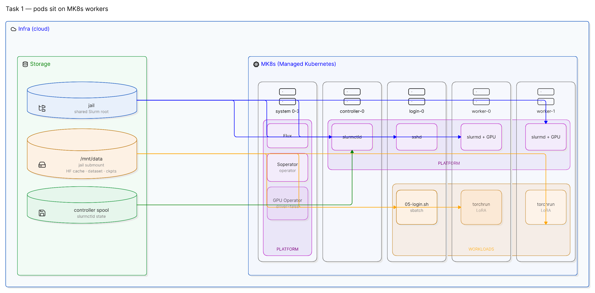
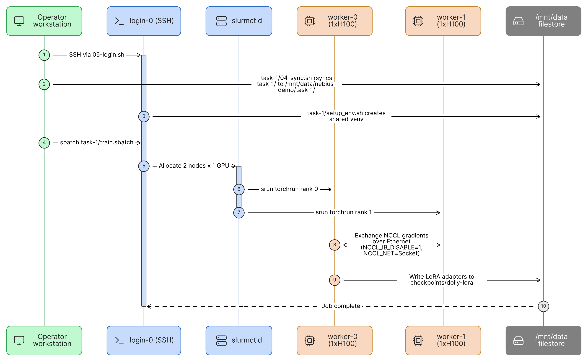
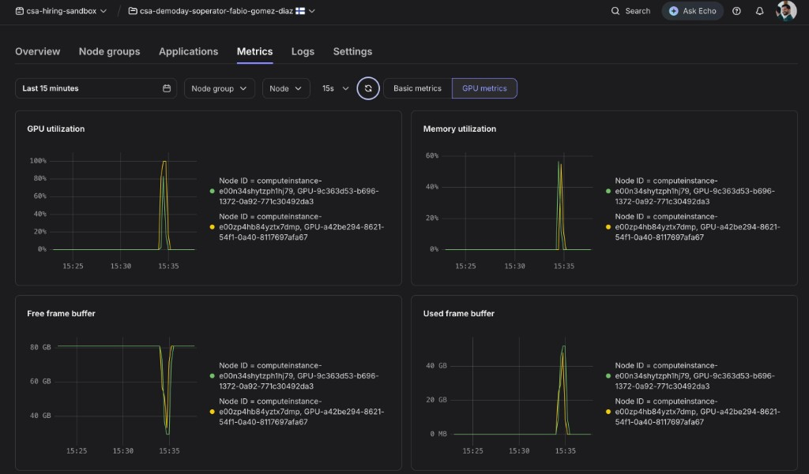
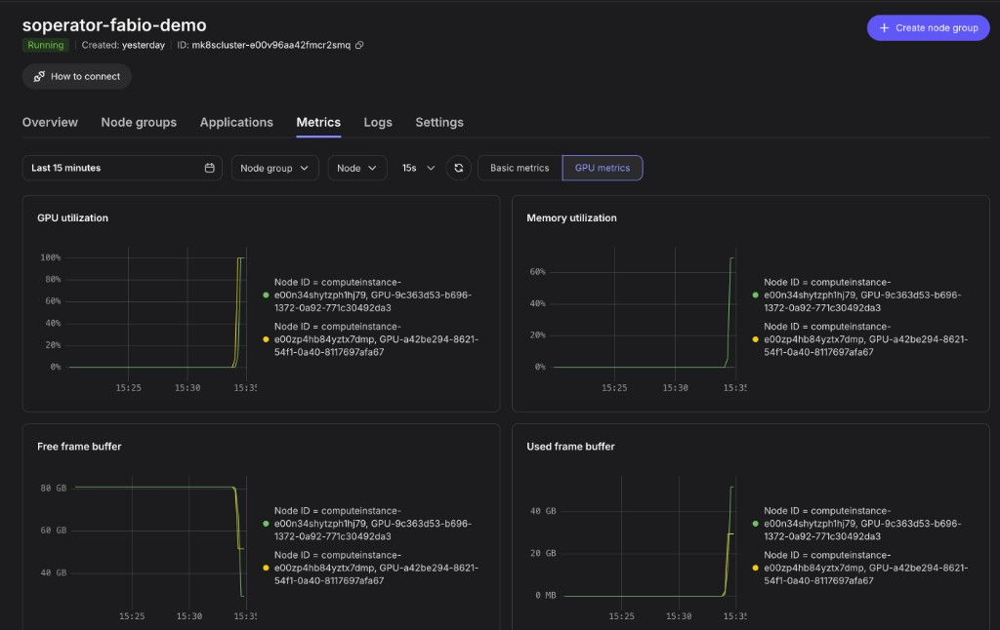
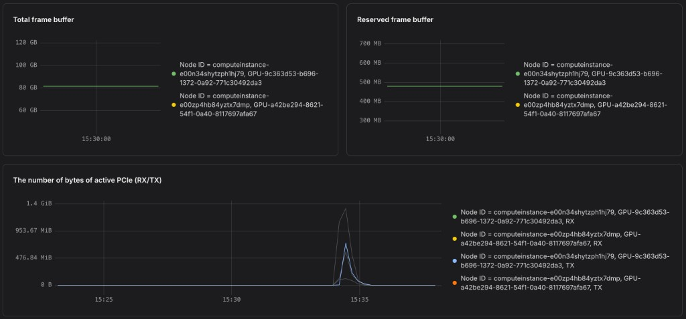
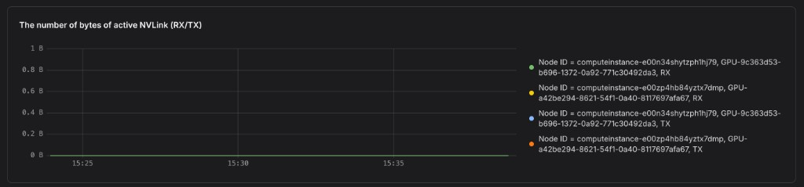
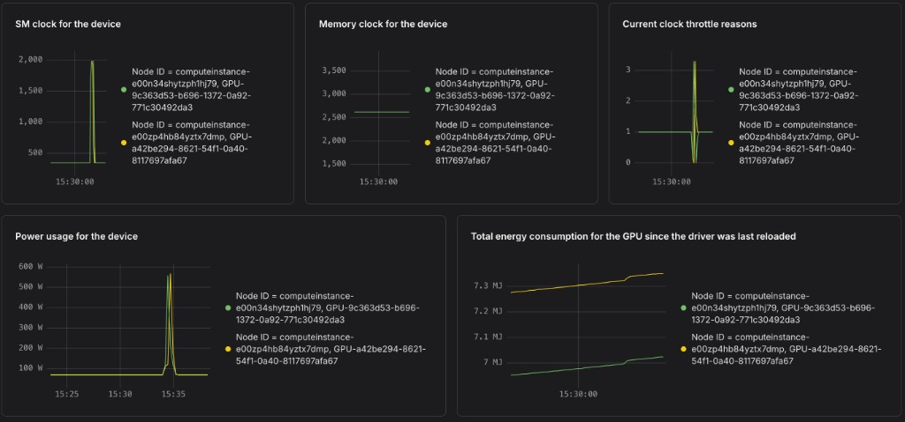
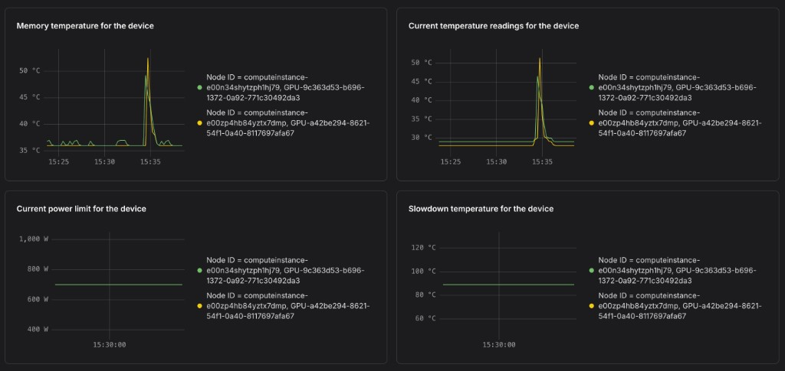
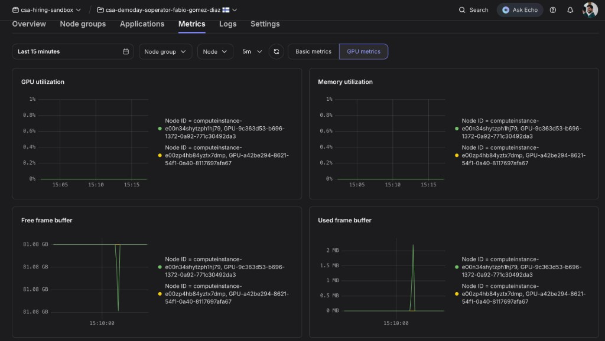

# Task 1 report — distributed LoRA SFT on Soperator

**Presenter:** Fabio Gomez Diaz  
**Cluster:** `csa-demodays-soperator-fabio-gomez-diaz` (MK8s)  
**Proof job:** Slurm **73** (`dolly-lora`), 2026-09-12 ~15:33–15:35 EDT  
**Recipe:** [soperator-v4.1.8-1](https://github.com/nebius/nebius-solutions-library/releases/tag/soperator-v4.1.8-1) (not `main`)

This is the talk track for **task 1**: run a distributed fine-tune on Soperator, on **2×H100 / 1 GPU per node / no InfiniBand**, after changing the stock Terraform recipe so that preset works. Screenshots and log excerpts below are the evidence. Exact commands from laptop → login → `sbatch`: [Command walkthrough](#command-walkthrough-live-demo).

Assignment: [../overview/assignment.md](../overview/assignment.md). Architecture: [architecture.md](architecture.md). Gotchas: [gotchas.md](gotchas.md).

---

## 30-second pitch

The stock Soperator recipe assumes **8×H100 + InfiniBand**. This lab is **two Ethernet H100s**. I overlayed Terraform so Slurm still schedules GPUs (`gres.conf` `Cores=0-7`, sentinel `gpu_cluster.id`), then submitted a **2-node LoRA** job through Slurm — not a Kubernetes GPU Deployment.

Job **73** trained `Qwen/Qwen2.5-7B-Instruct` on Dolly (`train[:1500]`). Both ranks reported `world_size=2` and `cuda=True`. NCCL came up as `NET/Socket` on `eth0`. Loss dropped **2.25 → 1.71** in four steps (~35 s of train). Adapters landed on the shared filestore. The Nebius GPU dashboard shows **both cards at ~100% SM utilization** for that window, ~50 GB used framebuffer, and **zero NVLink** (expected: one GPU per node; gradients went over Ethernet).

---

## What the assignment asked vs what this report covers

| Assignment bullet | This report |
| --- | --- |
| Distributed train/fine-tune on Soperator, **latest tag not `main`** | **Done.** `soperator-v4.1.8-1`, job 73 |
| Manipulate Terraform for **1-GPU node, no InfiniBand** | **Done.** Sentinel GPU cluster + 1-GPU GRES |
| 2×H100, 1 GPU/node, one MK8s cluster | **Done.** `1gpu-16vcpu-200gb` × 2 |
| `public_o11y_enabled = false`, new jail, `yq` | **Done.** |
| Utilize **>80% of the GPUs** (console) | **Compute: yes** on job 73 (~100% SM). **HBM: no** (~55–70% memory). Spike was short (~35 s train). |
| Inference + serve the trained model | Extra mile — **not in this report** |
| Run the **base** model and **compare** | Extra mile — **not in this report** |

Completing task 1 is a pass. Keep the cluster; do not destroy it before the interview.

---

## Command walkthrough (live demo)

Two shells. **Laptop** = this git repo. **Login** = SSH to `login-0` (`root@login-0`). Do not run `06` / `07` in the interview; the assignment says keep the lab.

All laptop commands are from the repo root (`nebius-demo-day/`). Scripts `04` and `05` default to `~/.ssh/id_rsa`.

### 1. Laptop — tools and Terraform inputs

```bash
# CLI tools (Terraform, Nebius CLI, kubectl, Helm, jq, yq). Skips what is already on PATH.
./scripts/00-install_prereqs.sh

# One-time Nebius login if this machine has no profile yet.
nebius profile create

# Writes tenant / project / region / subnet into terraform/infra/terraform.tfvars
# and the SSH public-key path + kubeconfig path into terraform/platform/terraform.tfvars.
./scripts/01-seed_tfvars.sh
```

### 2. Laptop — infra (cloud only)

```bash
# terraform init + apply in terraform/infra.
# Creates MK8s, node groups (system, login, controller, GPU workers, …), filestore, kubeconfig.
# Does NOT install Soperator. Tens of minutes.
./scripts/02-apply_infra.sh
```

That script is `terraform init -reconfigure && terraform apply` in `terraform/infra`. It also refreshes `NEBIUS_IAM_TOKEN` and writes `terraform/kubeconfig`.

### 3. Laptop — platform (operators on that cluster)

```bash
# terraform init + apply in terraform/platform.
# Flux, Soperator/Slurm, NVIDIA GPU Operator (driver.enabled=false).
# Overlay skips ActiveChecks that would hang 240 minutes on this Ethernet 1-GPU lab.
./scripts/03-apply_platform.sh
```

Sanity check from the laptop (kubeconfig from infra):

```bash
export KUBECONFIG="$PWD/terraform/kubeconfig"
kubectl config use-context nebius-<company_name>-slurm   # company_name from terraform.tfvars
kubectl get nodes
kubectl get pods -A
kubectl get slurmcluster -A
```

Workers for training are the GPU nodes. Login SSH goes through LoadBalancer `soperator-login-svc` (script `login_host.sh` reads that IP).

### 4. Laptop — copy job files onto `/mnt/data`

Terraform does **not** put `train.py` on the cluster. Sync does:

```bash
# rsync task-1/ → root@<login-ip>:/mnt/data/nebius-demo/task-1/
# Same disk the GPU workers mount, so both ranks see the scripts.
./scripts/04-sync_task-1.sh
```

Re-run this after any local edit to `train.py` / `train.sbatch` (that is how the job-71 `SFTConfig` fix got onto the jail).

### 5. Laptop — SSH to the login node

```bash
./scripts/05-login.sh
# same as: ssh -i ~/.ssh/id_rsa root@<soperator-login-svc IP>
```

Prompt becomes `root@login-0`. Everything below is **on login**, not on the laptop.

### 6. Login — shared Python env (once)

```bash
# venv on /mnt/data so worker-0 and worker-1 share the same interpreter.
# Not /tmp — that is local to one node.
cd /mnt/data/nebius-demo
bash task-1/setup_env.sh
```

### 7. Login — is Slurm up?

```bash
sinfo          # partitions + node states; want workers idle (or already alloc)
sinfo -N       # one line per node
```

Partition we submit to is **`main`** (default). `login` is the SSH box, not a partition.

### 8. Login — submit the training job

```bash
mkdir -p /mnt/data/nebius-demo/outputs

# Queue the script. Does not run it on login. Prints: Submitted batch job <id>
# Do NOT use sbatch --wrap here; #SBATCH lines inside the file would be ignored.
sbatch /mnt/data/nebius-demo/task-1/train.sbatch

# Snapshot of the queue. R = running, PD = waiting. Empty = nothing current.
squeue
```

Job 73 looked like:

```text
JOBID PARTITION     NAME     USER ST       TIME  NODES NODELIST(REASON)
   73      main dolly-lo     root  R       0:54      2 worker-[0-1]
```

`sbatch` only **enqueues**. The controller starts the script on `worker-0` and `worker-1` when they are free. `squeue` only **looks**; it does not run the queue.

### 9. Login — watch logs while it runs

`%j` in the batch script is the job id (`73`):

```bash
tail -f /mnt/data/nebius-demo/outputs/train-73.log
tail -f /mnt/data/nebius-demo/outputs/train-73.err
```

`Ctrl-C` stops `tail` only, not the job. To kill the job: `scancel 73`.

What to look for in `.log`:

```text
world_size=2
cuda=True
via NET/Socket/0
Init COMPLETE
{'loss': ...}
saved LoRA adapters to /mnt/data/nebius-demo/checkpoints/dolly-lora
```

### 10. Login — job details (accounting is off)

`sacct` prints `Slurm accounting storage is disabled` on this cluster. Use:

```bash
scontrol show job 73
```

Useful fields: `JobState`, `RunTime`, `NodeList=worker-[0-1]`, `TresPerNode=gres/gpu:1`, `StdOut` / `StdErr`.

After the job has been gone a while, `scontrol` forgets it. The log files on `/mnt/data` stay.

### 11. Login — did it write adapters?

```bash
ls -lh /mnt/data/nebius-demo/checkpoints/dolly-lora
squeue    # should be empty when finished
```

### 12. Nebius console (browser)

MK8s cluster → **Metrics** → **GPU metrics**, last 15 minutes, 15 s. Same window as job 73 (~15:35 local). That is where the screenshots in this report came from.

---

Where each command runs:

| Step | Where | What it actually does |
| --- | --- | --- |
| `00`–`01` | laptop | Tools + tfvars |
| `02` | laptop | Cloud: MK8s + disks |
| `03` | laptop | Operators: Slurm/Soperator |
| `kubectl …` | laptop | Inspect K8s |
| `04` | laptop | Copy files onto shared `/mnt/data` |
| `05` | laptop → login | SSH |
| `setup_env.sh` | login | Shared venv |
| `sinfo` / `sbatch` / `squeue` | login | Slurm |
| `tail` / `ls` | login | Read `/mnt/data` |
| GPU dashboards | browser | Proof the H100s worked |

Do **not** destroy (`./scripts/06-destroy_platform.sh` then `./scripts/07-destroy_infra.sh`) until after the interview.

---

## Architecture (what we deployed)



Eraser: [Task 1 architecture](https://app.eraser.io/workspace/I4wdFNgdsHcbQn0oumUc?diagram=z62t59f-LiZq5ubZeN0E&layout=canvas).

Talking points:

- **Infra** (Terraform → Nebius API): MK8s node groups + filestore. No Helm.
- **Platform** (Terraform → kubeconfig): Flux, Soperator, NVIDIA GPU Operator (`driver.enabled=false`; drivers are on the MK8s image).
- **Workloads:** `sbatch` on the login node. Worker pods already hold `nvidia.com/gpu`, so a competing GPU Deployment would stay `Pending`.

| Role | What runs there | GPU? |
| --- | --- | --- |
| `system 0–3` | Flux, Soperator operator, GPU Operator | No |
| `controller-0` | `slurmctld` | No |
| `login-0` | SSH + `sbatch` / `sinfo` | No |
| `worker-0`, `worker-1` | `slurmd` + the training processes | 1×H100 each |

Shared disks:

| Volume | Who mounts it | Used for |
| --- | --- | --- |
| Jail | Slurm pods | Shared OS / venv |
| `/mnt/data` | login + both workers | Scripts, HF cache, logs, checkpoints |
| Controller spool | controller only | Scheduler state |

`/mnt/data` is on the **login** node so you can `sbatch` the same files the workers execute, and `tail` the same logs they write.

---

## How the job runs



Eraser: [training sequence](https://app.eraser.io/workspace/sMTFzEg0NEXUxYUbYetV?diagram=1ZG1AC1pKv2-lFeKximp&layout=canvas). Inside `train.py`: [how train.py works](https://app.eraser.io/workspace/WhfhqNvtzQqdMDHNmSNk?diagram=FRx91CaBWFE7llagz8xQ&layout=canvas).

```text
sbatch train.sbatch
        → slurmctld allocates worker-0 and worker-1 (1 GPU each)
        → srun torchrun  (1 process per node)
        → NCCL averages gradients over Ethernet (not InfiniBand)
        → rank 0 writes LoRA adapters to /mnt/data
```

Job 73 request: `--nodes=2 --gpus-per-node=1 --cpus-per-task=8 --mem=80G --time=02:00:00`, partition `main`.

NCCL is forced onto Ethernet because this preset has no IB fabric:

```bash
export NCCL_IB_DISABLE=1
export NCCL_NET=Socket
export NCCL_SOCKET_IFNAME=eth0
```

Rendezvous uses the **eth0** IPv4 address. `hostname -I` can return `docker0` (`172.17.0.1`) first and the two ranks never meet.

What we trained (job 73):

| Knob | Value |
| --- | --- |
| Base model | `Qwen/Qwen2.5-7B-Instruct` |
| Method | LoRA SFT (`trl.SFTTrainer`), adapters only |
| Data | `databricks/databricks-dolly-15k` `train[:1500]` |
| Parallelism | 2 nodes × 1 GPU, PyTorch DDP via `torchrun` |
| Precision | bf16 |
| Checkpoint | `/mnt/data/nebius-demo/checkpoints/dolly-lora` |

Why LoRA 7B: fits one 80 GB H100 with a useful batch, finishes in a lab window, still loads both GPUs. Full 7B SFT is slower and easier to OOM.

---

## Proof — Slurm and logs (job 73)

### Queue while it ran

```text
JOBID PARTITION     NAME     USER ST       TIME  NODES NODELIST(REASON)
   73      main dolly-lo     root  R       0:54      2 worker-[0-1]
```

Both compute nodes allocated. Login did not run the GPU work.

`sacct` is **disabled** on this cluster (`Slurm accounting storage is disabled`). Runtime and TRES come from `scontrol show job` while the job is still in memory, plus the log files.

### Distributed + CUDA (both ranks)

From `/mnt/data/nebius-demo/outputs/train-73.log`:

```text
nodes=worker-0 worker-1
rdzv=<eth0 ip>:29500
NCCL_SOCKET_IFNAME=eth0
local_rank=0 world_size=2 cuda=True
gpu=NVIDIA H100 80GB HBM3 n_gpu=1
dataset=databricks/databricks-dolly-15k split=train[:1500]
```

Printed twice (once per rank). That is the “two GPUs, not a CPU job” check.

### NCCL over Ethernet, not InfiniBand / NVLink

```text
Channel 00/0 : 1[0] -> 0[0] [receive] via NET/Socket/0
Channel 00/0 : 0[0] -> 1[0] [send] via NET/Socket/0
ncclCommInitRank ... rank 0 nranks 2 ... Init COMPLETE
ncclCommInitRank ... rank 1 nranks 2 ... Init COMPLETE
```

`NET/Socket` is TCP. Tuner plugin missing (`libnccl-net.so`) is noise; NCCL still completed init with the internal tuner.

### Loss went down, then adapters saved

```text
{'loss': 2.2472, 'learning_rate': 0.0,    'epoch': 0.21}
{'loss': 2.3054, 'learning_rate': 0.0002, 'epoch': 0.42}
{'loss': 1.9676, 'learning_rate': 0.00015,'epoch': 0.63}
{'loss': 1.7063, 'learning_rate': 5e-05,  'epoch': 0.84}
{'train_runtime': 34.6648, 'train_loss': 2.0566, 'epoch': 0.84}
saved LoRA adapters to /mnt/data/nebius-demo/checkpoints/dolly-lora
```

Four optimizer steps (`4/4` on stderr). First `learning_rate: 0.0` is warmup. `epoch: 0.84` with `packing=True` is expected (packed tokens, not a full unused tail). NCCL `Abort COMPLETE` after save is communicator teardown, not a crash.

Stderr warnings that **did not** fail the job: `TRANSFORMERS_CACHE` deprecated, Qwen sliding-window / SDPA, NCCL barrier device_id, `No label_names` on `PeftModel`, `destroy_process_group()` at exit.

Logs on the jail:

```text
/mnt/data/nebius-demo/outputs/train-73.log
/mnt/data/nebius-demo/outputs/train-73.err
/mnt/data/nebius-demo/checkpoints/dolly-lora
```

---

## Proof — Nebius GPU dashboards (job 73)

Window: **last 15 minutes**, **15 s** scrape, **GPU metrics** tab. Both series are the two H100 workers:

- green: `computeinstance-e00n34shytzph1hj79`
- yellow: `computeinstance-e00zp4hb84yztx7dmp`

Spike time **~15:35** local matches job 73 (~20:33–20:34 UTC).

### 1. Compute and memory — this is the money slide



| Panel | What it shows | Why it matters |
| --- | --- | --- |
| **GPU utilization** | Both GPUs spike to **~100%** | Cards were busy. Clears “>80% of the GPUs” if that means SM util. |
| **Memory utilization** | Peak **~55–70%** | Weights + activations on device; not an empty CUDA context. |
| **Free frame buffer** | Drops from ~80 GB to ~30 GB | Same story in bytes. |
| **Used frame buffer** | Rises to **~50 GB** | Contrast with the failed job (~2 MB). |

The pulse is **narrow** because train runtime was **34.7 s**. Idle on either side is the cluster waiting, not a failed train.

Same window, rising edge while the job was still `R`:



### 2. Cross-node traffic is PCIe + Ethernet, not NVLink



PCIe RX/TX on both nodes jumps to ~1 GiB during the same minute (host ↔ GPU). Reserved framebuffer stays ~500 MB (driver). Total framebuffer ~80 GB/card.



**NVLink is flat zero.** Correct: each node has **one** GPU, so there is no NVLink peer. Rank 0 ↔ rank 1 is **NCCL Socket / Ethernet**, which matches the log (`NET/Socket`). Do not treat missing NVLink as a failed fabric.

### 3. Power, clocks, temperature — the GPUs actually worked



| Panel | Idle | During job 73 |
| --- | --- | --- |
| SM clock | ~400 MHz | ~**2000 MHz** |
| Power | ~70–90 W | **~500 W** |
| Energy | slow creep | visible step on both cards |
| Throttle reasons | ~1 | brief dip, not a sustained throttle |



Memory/package temp ~35 °C → **~50 °C**. Power limit ~700 W, slowdown temp 90 °C. We were **not** thermally limited.

---

## Contrast: job 71 (failed) vs job 73 (trained)

Job 71 ran **32 s**, `FAILED` / `ExitCode=1:0`, same two workers. The Python error was:

```text
TypeError: SFTConfig.__init__() got an unexpected keyword argument 'args'
```

Slurm, CUDA, and Dolly load had already succeeded. The script passed an invalid TRL kwarg (`args=args.output`). Dashboard for that window:



| | Job 71 | Job 73 |
| --- | --- | --- |
| State | `FAILED` | `COMPLETED` (log + adapters) |
| GPU util | ~0% | ~100% |
| Used FB | ~2 MB | ~50 GB |
| Meaning | CUDA context, then crash | Real 7B LoRA |

That pair of screenshots is the simplest “we actually trained” proof.

---

## What we had to change in Terraform (the interview meat)

Stock recipe = 8-GPU NVLink node + InfiniBand GPU cluster. This preset cannot join a GPU cluster.

### 1. No InfiniBand

`gpu_cluster.id = "ethernet-not-attached"` so validation passes without creating a real GPU cluster. No Network Operator. NCCL flags in `train.sbatch` force Socket/Ethernet.

### 2. GRES (Slurm’s GPU map)

Slurm does **not** discover GPUs like Kubernetes. `slurmctld` reads `gres.conf`. Stock map is 8×H100 (`Cores=0-31`). These nodes are 1 GPU / 16 logical CPUs (`S:C:T = 1:8:2`).

| Map | Result |
| --- | --- |
| `Cores=0-31` | `slurmctld` CrashLoop: invalid GRES, only 16 CPUs |
| `Cores=0-15` | Controller starts, but GPU jobs sit `PD (Resources)` |
| **`Cores=0-7`** | GPU binds (`Gres=…(S:0)`), `cuda=True` |

Overlay: `terraform/infra/04-outputs.tf`. Detail: [terraform-infiniband.md](terraform-infiniband.md).

### 3. Platform apply would wait 240 minutes

Ethernet 1-GPU lab never writes some ActiveCheck statuses. Flux overlay sets `runAfterCreation: false` on those checks so `03-apply_platform.sh` can finish.

### 4. Other assignment knobs

`public_o11y_enabled = false`. New jail (not reused). `yq` on the apply host. CPU table: system / login / controller (+ accounting and NFS in Terraform for the 8×64 vCPU guideline).

---

## How to walk this in the room

1. **Constraint** — 2×1×H100, no IB, tag `4.1.8`, not `main`.
2. **Commands** — [Command walkthrough](#command-walkthrough-live-demo): `00`→`05` on the laptop, then `sbatch` / `squeue` / `tail` on login. Cluster is already up; you can start at `05-login.sh` and only re-run `04` if files changed.
3. **Cluster picture** — architecture PNG; `sinfo` if you are on login.
4. **Why Slurm** — workers already hold the GPUs.
5. **GRES + sentinel cluster** — the two overlays that made the recipe work.
6. **Job 73 log** — `world_size=2`, `NET/Socket`, loss 2.25 → 1.71, `saved LoRA adapters`.
7. **Dashboards** — 100% util / 50 GB FB vs job 71’s 2 MB. NVLink = 0 on purpose.
8. **Honest extras** — inference, base-vs-LoRA compare, and a *sustained* 80% HBM fill are not done. Compute 80% **was** hit.

If asked “would 8×H100 + IB change this?”: set a real fabric, drop `NCCL_IB_DISABLE`, drop the 1-GPU GRES override, `--nproc_per_node=8`, add Network Operator if images are not driverfull.

---

## File map

| Path | What |
| --- | --- |
| `scripts/00`–`05` | Prereqs → seed → infra → platform → sync → SSH |
| `terraform/infra` | MK8s, node groups, filestore, GRES / GPU-cluster overlay |
| `terraform/platform` | Flux, Soperator, GPU Operator |
| `task-1/train.sbatch` | Slurm + NCCL + `torchrun` |
| `task-1/train.py` | LoRA SFT |
| `/mnt/data/nebius-demo/outputs/train-73.log` | Job 73 stdout |
| `/mnt/data/nebius-demo/checkpoints/dolly-lora` | Adapters |
| `docs/task-1/static/evidence/` | Console PNGs used here |
