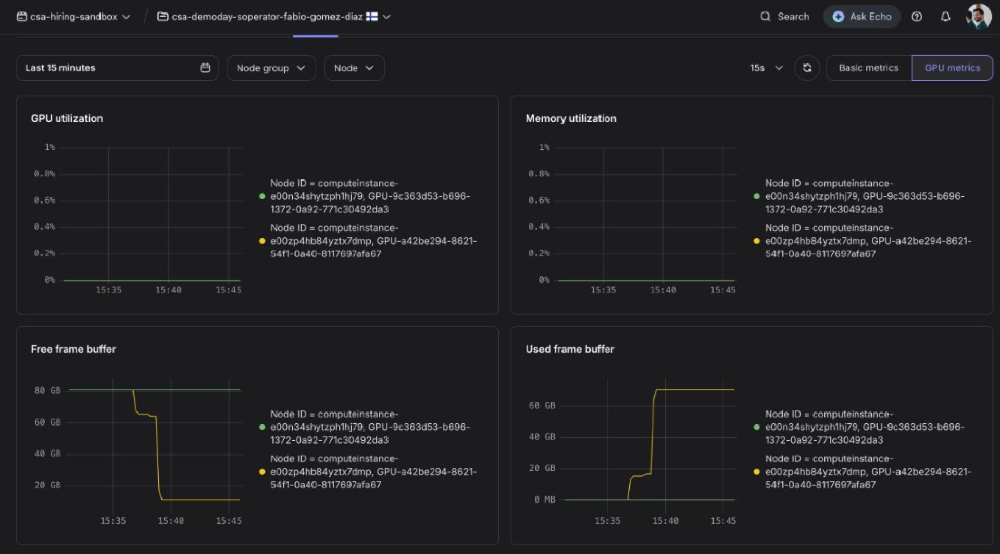
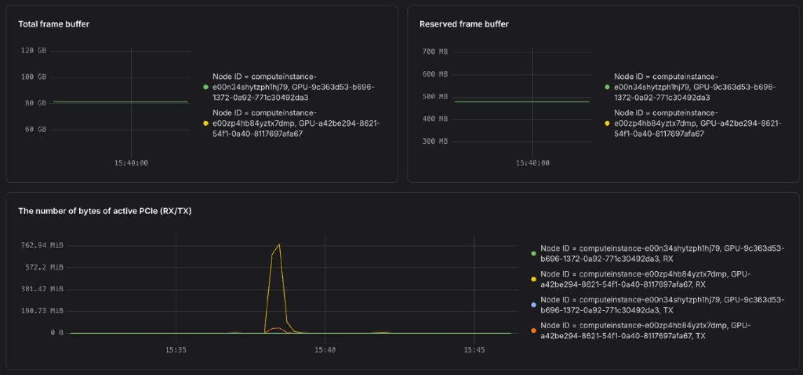
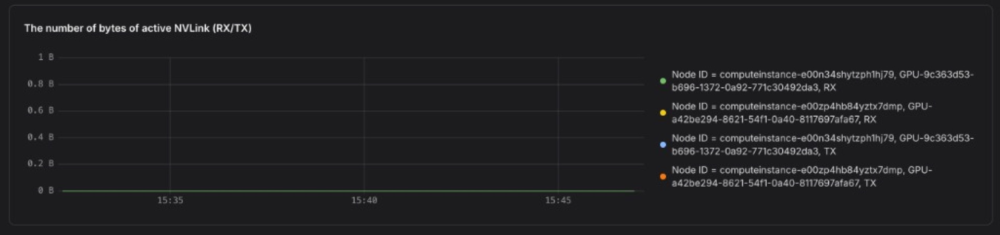
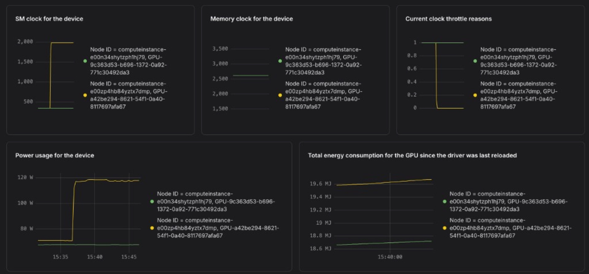
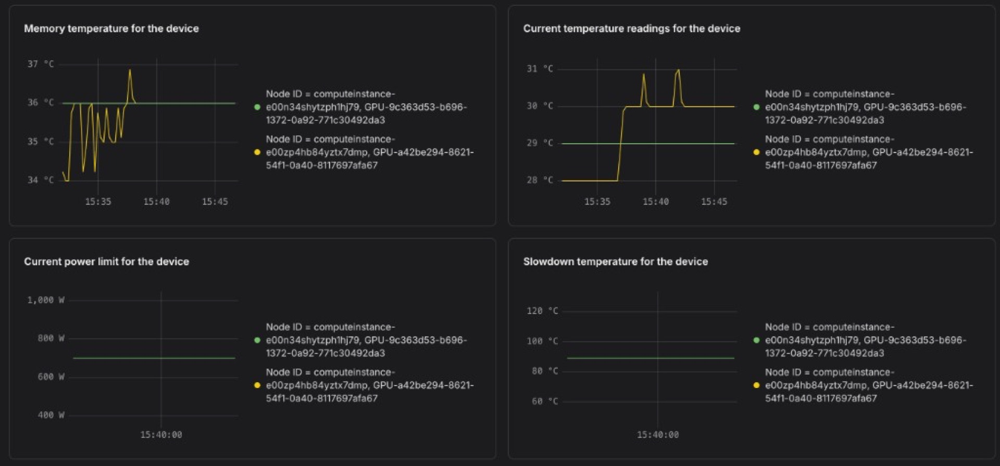

# Task 2 report — serve the trained LoRA on the same MK8s cluster

**Presenter:** Fabio Gomez Diaz  
**Cluster:** `csa-demodays-soperator-fabio-gomez-diaz` (MK8s)  
**Proof:** vLLM `v0.10.2` in namespace `task2-inference`, 2026-09-14 ~13:36–13:41 (pod clock)  
**Adapters:** job **73** at `/mnt/data/nebius-demo/checkpoints/dolly-lora`

This is the talk track for **task 2** (extra mile): run **inference** on the **same Kubernetes cluster**, **serving** the model trained in task 1. GPU limit is still 2×H100 (1 per node). Training write-up: [../task-1/report.md](../task-1/report.md). Runbook: [README.md](README.md).

Assignment: [../overview/assignment.md](../overview/assignment.md). Status: [../overview/status.md](../overview/status.md).

---

## 30-second pitch

Both H100s were held by Soperator `worker-0` / `worker-1`. I did **not** destroy platform or the GPU VMs. I scaled the Slurm **NodeSet** 2 → 1 (Flux-patched, so it does not snap back after five minutes), then scheduled a vLLM Deployment in its own namespace **`task2-inference`** on the freed card. It mounts the same jail `/mnt/data` that job 73 wrote.

The OpenAI-compatible server loaded `Qwen/Qwen2.5-7B-Instruct` plus LoRA **`dolly`**. A laptop `curl` to `/v1/chat/completions` with `"model":"dolly"` returned **200** and a 128-token answer about Databricks Dolly.

---

## What the assignment asked vs what this report covers

| Assignment bullet | This report |
| --- | --- |
| Inference on the **same** MK8s cluster, **serving** the trained model | **Done.** vLLM in `task2-inference`, adapters from job 73 |
| Do not destroy the lab | **Done.** Login, jail, `worker-0`, checkpoints all stayed |
| 2×H100, 1 GPU/node | **Done.** One card stays on Slurm; one card serves |
| Run the **base** model and **compare** | Extra mile — **not this report** (base is served as `qwen25-7b`; no side-by-side yet) |

Flip back to a two-node train show with `./task-1/03-apply_platform.sh`. Do not `terraform destroy`.

---

## Command walkthrough (what I ran)

Laptop, repo root `nebius-demo-day/`. Cluster already up from task 1. Kubeconfig is `terraform/kubeconfig`.

### 1. Free one H100 without tearing Soperator down

A Kubernetes GPU pod stays `Pending` while both worker pods request `nvidia.com/gpu: 1`. Scale **pods**, not the MK8s node group.

```bash
./task-2/02-serve.sh
```

That script:

1. Deletes any leftover vLLM (including an earlier scaffold in `soperator`).
2. Applies `k8s/flux-pause.yaml` (pause Flux) and `k8s/workers-1.yaml` (NodeSet **replicas=1**). A bare `kubectl scale` is reverted in ~5 minutes.
3. Waits until `worker-1` is gone.
4. Applies namespace `task2-inference`, a second PV/PVC on `/mnt/jail-submount-data`, then `task-2/k8s/vllm.yaml` and `task-2/k8s/ingress.yaml`.

Look:

```bash
./task-2/03-status.sh
# NodeSet worker replicas=1
# vLLM in task2-inference
```

### 2. First start failed — Kubernetes `VLLM_PORT`

The Service is named `vllm`. Kubernetes injected:

```text
VLLM_PORT=tcp://10.0.194.112:8000
```

vLLM treats `VLLM_PORT` as a listen port, not a service URL. EngineCore died at init (`ValueError: VLLM_PORT ... appears to be a URI`). `--port 8000` does not override it. Documented at [vLLM env vars](https://docs.vllm.ai/en/stable/serving/env_vars.html).

Fix in the Deployment: `enableServiceLinks: false`. Re-applied `task-2/k8s/vllm.yaml`. Pod `vllm-76b7b8bdc-zcjrb` then started cleanly.

### 3. Engine came up; LoRA loaded from the jail

From `kubectl logs -f` on that pod:

```text
Starting to load model Qwen/Qwen2.5-7B-Instruct...
Time spent downloading weights for Qwen/Qwen2.5-7B-Instruct: 64.726116 seconds
Model loading took 14.5499 GiB
Loaded new LoRA adapter: name 'dolly', path '/mnt/data/nebius-demo/checkpoints/dolly-lora'
Starting vLLM API server 0 on http://0.0.0.0:8000
GET /health HTTP/1.1" 200 OK
```

`--lora-modules dolly=/mnt/data/nebius-demo/checkpoints/dolly-lora` is explicit. vLLM does not scan for the latest checkpoint.

Weights were **re-downloaded** (~65 s) even though `HF_HOME` points at `/mnt/data/nebius-demo/hf_cache`. Harmless this run; torch.compile cache also landed on the container disk (`/root/.cache/vllm`), not the PVC.

### 4. Laptop — port-forward and query

Service is ClusterIP. Forward from the laptop (this demo used local port **8008**):

```bash
kubectl --kubeconfig terraform/kubeconfig -n task2-inference \
  port-forward svc/vllm 8008:8000
```

```bash
curl -s http://127.0.0.1:8008/v1/chat/completions \
  -H 'Content-Type: application/json' \
  -d '{"model":"dolly","messages":[{"role":"user","content":"What is Databricks Dolly?"}],"max_tokens":128}' | jq .
```

vLLM log for those calls:

```text
POST /v1/chat/completions HTTP/1.1" 200 OK
Avg prompt throughput: 7.4 tokens/s, Avg generation throughput: 25.6 tokens/s
Prefix cache hit rate: 57.7%
```

### 5. Flip back to task 1 (when needed)

```bash
./task-1/03-apply_platform.sh
```

Deletes the vLLM Deployment/Service, resumes Flux, scales workers **1 → 2**, waits until `worker-0` and `worker-1` are Ready. Namespace `task2-inference` and the `/mnt/data` claim stay. Login SSH and jail are unchanged. A 2-node `sbatch` is `PD` while you are in serve mode.

Do **not** scale the GPU **node group** to 0. Do **not** scale Slurm workers to 0 if you still want a live `sinfo`.

---

## Evidence (live query)

`POST /v1/chat/completions` with `"model":"dolly"` (LoRA from job 73):

```json
{
  "id": "chatcmpl-45f4666fc713423496086d02bc0090a3",
  "object": "chat.completion",
  "created": 1789418480,
  "model": "dolly",
  "choices": [
    {
      "index": 0,
      "message": {
        "role": "assistant",
        "content": "Databricks Dolly is a large language model developed by Databricks, which is a company that provides cloud-based services for data engineering, machine learning, and analytics. Databricks Dolly is an open-source model designed to be a community version of Databricks' larger models like Dolly 2.0, which is built on top of the PyTorch framework.\n\nThe purpose of Databricks Dolly is to provide a smaller, more accessible model that can be used for various natural language processing tasks such as text generation, question answering, and more. It is intended to be a stepping stone for developers and researchers",
        "refusal": null
      },
      "finish_reason": "length"
    }
  ],
  "usage": {
    "prompt_tokens": 37,
    "total_tokens": 165,
    "completion_tokens": 128
  }
}
```

`finish_reason: length` is expected: `max_tokens` was 128.

Served names:

| `model` | Weights |
| --- | --- |
| `dolly` | Qwen2.5-7B-Instruct + job 73 LoRA (this curl) |
| `qwen25-7b` | base, no adapters (not queried in this report) |

---

## Proof — `nvidia-smi` in the vLLM pod

Same pod (`vllm-76b7b8bdc-zcjrb`, `1/1 Running`). Host metrics first:

```text
kubectl top pod vllm-76b7b8bdc-zcjrb
NAME                   CPU(cores)   MEMORY(bytes)
vllm-76b7b8bdc-zcjrb   7m           18503Mi
```

Then on the card:

```text
kubectl exec -it vllm-76b7b8bdc-zcjrb -- nvidia-smi

Mon Sep 14 13:44:40 2026
+-----------------------------------------------------------------------------------------+
| NVIDIA-SMI 580.173.02             Driver Version: 580.173.02     CUDA Version: 13.0     |
+-----------------------------------------+------------------------+----------------------+
| GPU  Name                 Persistence-M | Bus-Id          Disp.A | Volatile Uncorr. ECC |
| Fan  Temp   Perf          Pwr:Usage/Cap |           Memory-Usage | GPU-Util  Compute M. |
|                                         |                        |               MIG M. |
|=========================================+========================+======================|
|   0  NVIDIA H100 80GB HBM3          On  |   00000000:8D:00.0 Off |                    0 |
| N/A   30C    P0            117W /  700W |   70323MiB /  81559MiB |      0%      Default |
|                                         |                        |             Disabled |
+-----------------------------------------+------------------------+----------------------+

+-----------------------------------------------------------------------------------------+
| Processes:                                                                              |
|  GPU   GI   CI              PID   Type   Process name                        GPU Memory |
|        ID   ID                                                               Usage      |
|=========================================================================================|
|    0   N/A  N/A             117      C   VLLM::EngineCore                      70314MiB |
+-----------------------------------------------------------------------------------------+
```

| Signal | Value | Meaning |
| --- | --- | --- |
| Process | `VLLM::EngineCore` | Engine is alive and owns the GPU |
| VRAM | **70323 / 81559 MiB** (~86%) | 7B weights (~14.5 GiB) plus **pre-allocated KV cache** (`gpu_memory_utilization: 0.85`) |
| GPU-Util | **0%** | No decode in flight (parked between curls) |
| Power | **117 W / 700 W** | Idle H100. Job 73 train was ~500 W |
| Temp | **30 °C** | Far from slowdown |
| `kubectl top` | **7m CPU**, ~18 GiB RAM | Health probes only |

vLLM grabs most of the card at startup so the next request does not allocate KV cache from scratch. High HBM + 0% SM is **ready**, not **busy**. A live `curl` spikes util for a second or two; the log already showed that (`25.6 tokens/s`).

---

## Proof — Nebius GPU dashboards (serve)

Window: **last 15 minutes**, **15 s** scrape, **GPU metrics** tab, 2026-09-14 ~15:35–15:45 local (engine start ~15:36, curls ~15:41, `nvidia-smi` ~15:44).

- green: `computeinstance-e00n34shytzph1hj79` — remaining Slurm worker (GPU idle)
- yellow: `computeinstance-e00zp4hb84yztx7dmp` — vLLM on the freed H100

PNGs are 1920 px wide: [`static/evidence/`](static/evidence/).

### 1. Framebuffer is full; SM util is not



| Panel | What it shows | Why it matters |
| --- | --- | --- |
| **GPU utilization** | Both series stay at **~0%** | Parked engine. Contrast job 73 (~100% SM for ~35 s). |
| **Memory utilization** | Console **~0%** | Nebius “memory util” is not HBM fill. Trust framebuffer + `nvidia-smi`. |
| **Free frame buffer** | Yellow drops **~80 GB → ~10 GB** | Matches 70 GiB in use. |
| **Used frame buffer** | Yellow steps to **~70 GB** and holds | Weights + KV cache reserved. Green stays empty. |

The two-step rise on used FB is load then KV-cache init (logs: weights ~14.5 GiB, then `Available KV cache memory: 50.55 GiB`). It stays high after that — vLLM does not free it between requests.

### 2. PCIe spike is the weight load; NVLink stays zero



Yellow PCIe RX peaks ~**760 MiB** around 15:37–15:38 (the ~65 s Hugging Face download / HBM load). TX is small. Total framebuffer ~80 GB/card; reserved ~500 MB (driver). After load, PCIe is quiet — serving is compute on one GPU, not a second copy of the weights.



**NVLink is flat zero.** Same as task 1: one GPU per node, and this serve is **tensor_parallel_size=1**. Do not treat missing NVLink as a failed fabric.

### 3. Clocks up, power idle — ready, not training



| Panel | Green (Slurm worker) | Yellow (vLLM) |
| --- | --- | --- |
| SM clock | ~400 MHz | ~**1980 MHz** (stays up after load) |
| Power | ~70 W | **~120 W** (matches `nvidia-smi` 117 W) |
| Energy | flat | slow creep |
| Throttle reasons | ~1 | drops to 0 after start |

Job 73 was ~**500 W** and ~100% SM on **both** cards. Serve is one card, clocks high, power at idle-with-context. That is the parked-vLLM signature.



Package ~28 °C → **~30 °C**, memory ~34–37 °C. Power limit 700 W, slowdown 90 °C. Not thermally limited. Tiny spikes line up with load / the curls.

---

## Why a dedicated namespace

vLLM is not in `soperator`. That keeps Slurm (workers, login, original jail PVC) visually separate from inference (`kubectl -n task2-inference get pods`).

The original PVC `soperator/jail-submount-data-pvc` is Bound to PV `jail-submount-data-pv` (one PVC per PV). Task 2 adds PV `jail-submount-data-task2-pv` on the **same** node path `/mnt/jail-submount-data` (`Retain`) and PVC `task2-inference/jail-submount-data`.

Pod anti-affinity must set `namespaces: [soperator]`. Without that, a pod in `task2-inference` ignores `worker-0` and can land on the same H100.

---

## What I did not do

- Did not `terraform destroy` platform or infra.
- Did not scale the MK8s GPU node group.
- Did not merge LoRA into the base weights; vLLM loads adapters at request time via `--enable-lora`.
- Did not yet curl `qwen25-7b` vs `dolly` side by side (task 3).

---

## File map

| Path | What |
| --- | --- |
| `task-2/01-ingress.sh` | ingress-nginx LoadBalancer (once); prints A-record IP |
| `task-2/02-serve.sh` | Workers=1; apply namespace, data, vLLM, Ingress |
| `task-1/03-apply_platform.sh` | Delete vLLM + Ingress; workers=2 |
| `task-2/03-status.sh` | Worker pods, GPU allocation, vLLM, Ingress |
| `task-2/04-destroy_ingress.sh` | Remove controller only |
| `task-2/k8s/` | Namespace, jail PV/PVC, vLLM, Ingress, nginx Helm values |
| `docs/task-2/report.md` | This talk track |
| `docs/task-2/static/evidence/` | Console PNGs (1920 px) |
| `/mnt/data/nebius-demo/checkpoints/dolly-lora` | Job 73 adapters |
